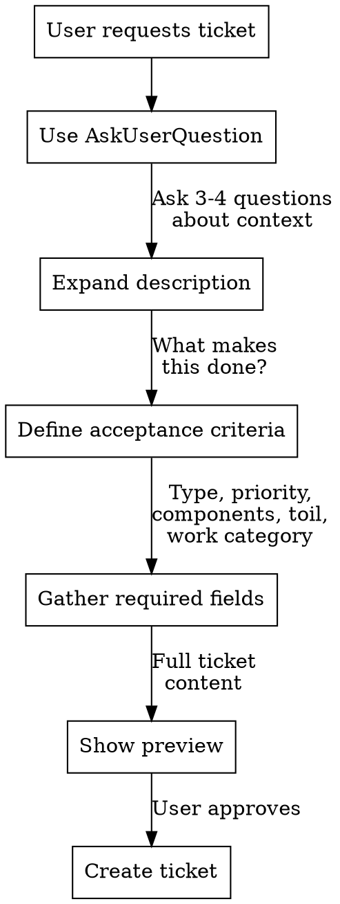

# Creating Jira Tickets

## Overview

**Guide users through systematic ticket refinement** from brief idea to complete, actionable Jira issue with all required fields and acceptance criteria.

## When to Use

Use when user requests creating a Jira ticket with:

- Brief description (1-2 sentences)
- Incomplete information
- Missing required fields

**Always use this workflow.** Even if user says "just create it" or "that's all the info needed."

## Required Fields Reference

**Metadata source**: `/Users/whegedus/bits/whegedus/scripts/jira/metadata/OY-Task.json`

| Field         | Flag                      | Required | Allowed Values                                      |
| ------------- | ------------------------- | -------- | --------------------------------------------------- |
| Summary       | `-s`                      | Yes      | Free text                                           |
| Type          | `-t`                      | Yes      | Task (default), Bug, Story                          |
| Priority      | `-y`                      | Yes      | Critical, High, Medium, Low, Undetermined (default) |
| Description   | `-b`                      | Yes      | Free text                                           |
| Component/s   | `-C`                      | Yes      | See Components section below                        |
| Toil Percent  | `--custom toil-percent=`  | Yes      | 0, 33, 66, 100                                      |
| Work Category | `--custom work-category=` | Yes      | See Work Category section below                     |
| Project       | `-p`                      | Yes      | OY (usually configured)                             |

### Components

Valid components (choose one or more):

- Alertmanager
- Autoremediation
- Documentation
- Gecko
- GitHub Actions
- Grafana
- host_sd
- KTLO
- Linmon
- log-collect
- Loki
- O11Y Apps Cluster
- Opentelemetry
- Pagerduty
- Policerbot
- Prometheus
- Redpanda
- Tempo
- Terraform
- Thanos
- VictoriaMetrics

### Work Category

Valid work categories (choose one or more):

- WL: Fault Management and Escalations
- WL: Alerts and Procedures
- WL: Change Safety
- WL: Configuration Management
- WL: KPI Definition and Measurement
- WL: Platform Oversight
- WL: Tools, Development and Support
- WL: Training / Onboarding
- WL: Hiring / Interviewing
- WL: Other

## Refinement Workflow



### Step 1: Expand Description

**Use AskUserQuestion to gather context.** Ask 3-4 clarifying questions about:

- What problem does this solve?
- Why is this needed now?
- What's the current behavior vs desired behavior?
- Any known constraints or dependencies?

Take the user's 1-2 sentence request and expand it into a detailed description paragraph.

### Step 2: Define Acceptance Criteria

**Always create acceptance criteria.** Never skip this.

Work with user to define 3-5 specific, testable conditions that indicate "done":

- What can be demonstrated?
- What tests must pass?
- What behaviors must change?

Format as checkbox list:

```
- [ ] Specific measurable outcome
- [ ] Another testable condition
- [ ] Edge case handled
```

### Step 3: Gather Required Fields

Use AskUserQuestion with structured options from the allowed values above:

**Type**: Task (default), Bug, Story
**Priority**: Critical, High, Medium, Low, Undetermined
**Component/s**: Choose ONLY from valid components list above (can be multiple)
**Toil Percent**: 0, 33, 66, or 100 (how much is repetitive work vs creative)
**Work Category**: Choose ONLY from valid work categories list above (can be multiple)

### Step 4: Show Preview

Show the user the complete ticket content before creating:

```
Summary: [one-line summary]
Type: Task (or Bug/Story)
Priority: [Critical/High/Medium/Low/Undetermined]

Description:
[Expanded description paragraph]

Acceptance Criteria:
- [ ] [criterion 1]
- [ ] [criterion 2]
- [ ] [criterion 3]

Component/s: [component(s)]
Toil Percent: [0/33/66/100]
Work Category: [category/categories]
```

Ask for approval before executing the command.

### Step 5: Create Ticket

Execute the jira CLI command (note: custom fields use kebab-case):

```bash
jira issue create \
  -t Task \
  -y [Priority] \
  -s "[Summary]" \
  -b "[Description + Acceptance Criteria]" \
  -C [Component] \
  --custom toil-percent=[0/33/66/100] \
  --custom work-category="[category]"
```

**Note**: For multiple components or work categories, repeat the flag: `-C Component1 -C Component2`

## Red Flags - STOP

These thoughts mean you're skipping the workflow:

| Excuse                  | Reality                              |
| ----------------------- | ------------------------------------ |
| "User gave enough info" | Always expand and refine             |
| "User seems in a hurry" | Quality tickets save time later      |
| "Just a simple bug"     | All tickets need acceptance criteria |
| "Can add details later" | Complete tickets prevent confusion   |
| "User said that's all"  | Guide them through refinement anyway |

## Common Mistakes

**Creating ticket immediately**: Always walk through refinement first, even under time pressure

**Skipping acceptance criteria**: Every ticket needs testable conditions for "done"

**Treating required fields as optional**: All fields in the table above are mandatory

**Not expanding description**: 1-2 sentences is never enough for an actionable ticket

## Example

**User says**: "Create a ticket for fixing the login timeout bug"

**Don't do**:

```bash
jira issue create -t Bug -s "Fix login timeout" -y High
```

**Do instead**:

1. **Use AskUserQuestion** to expand:
   - When does the timeout occur?
   - What's the expected timeout vs actual?
   - Which authentication method is affected?
   - Any error messages or logs?

2. **Define acceptance criteria** with user:
   - [ ] Login succeeds within 5 seconds on average connection
   - [ ] Timeout error shows clear message to user
   - [ ] Unit tests verify timeout handling

3. **Gather all required fields**:
   - Type: Task (default)
   - Priority: High
   - Component: O11Y Apps Cluster
   - Toil Percent: 33
   - Work Category: WL: Tools, Development and Support

4. **Show preview and get approval**

5. **Execute complete command**
